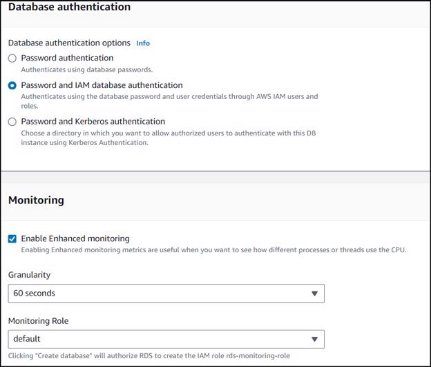

Securing a Cloud-based Healthcare Application in AWS

ENPM665 | Final Project Group 1

**Architectural Design and Overview of Proposed Healthcare Application**

*By*

*Abhilash Kamtam*

*Aditya Deshpande*

*Divya Puramsetty              Sunderarajan Sankarasubramanian Vishal Kinnera*

Executive Summary

The healthcare application(infrastructure) reflects a meticulous and strategic approach to address potential challenges in the cloud environment. Emphasizing key pillars such as cost optimization, performance, reliability, and security, the architecture establishes a robust foundation for healthcare operations. Adopting a dual-region strategy, with us-east-1 and us-west-1 configured in an Active-Passive mode, becomes pivotal for ensuring continuous business operations. This configuration guarantees that vital healthcare services remain accessible and functional, even in the event of region-wide outages or unforeseen disruptions.

The incorporation of Active-Active Availability Zones adds an extra layer of reliability by intelligently distributing resources across different zones. This not only enhances system resilience against network or hardware failures but also contributes to optimal performance. Key services, including Route53, VPC peering, Security Groups, and Network ACLs, collectively fortify the security posture of the infrastructure. The Elastic Load Balancer (ELB) optimizes server availability through even traffic distribution and health status validation. Key security measures, such as AWS WAF for web application security, AWS Shield Standard for DDoS protection, and a Network Firewall at the perimeter, collectively fortify the infrastructure against various threats.

A commitment to scalability, adaptability, and data protection is evident using high-capacity R5 instances, Auto Scaling Groups (ASG), and encrypted EBS volumes. In terms of network configuration, Route53 emerges as a pivotal component, providing reliable internet access with continuous health checks. The architecture's logically isolated VPCs, coupled with VPC peering connections, ensure secure communication between different VPCs. Security remains paramount with fine-grained control through IAM Roles, Security Groups, and Network ACLs, acting as a virtual firewall to restrict access. In addition, the MedCircle Identity Service, coupled with IAM roles assigned during patient registration, establishes a secure foundation for user authentication and authorization. This identity service ensures that only authorized entities, including patients, care providers, and IT employees, gain access to the healthcare application.

Real-time monitoring and logging are paramount components that are achieved through CloudWatch, CloudTrail, Guard Duty, and Amazon Inspector integration. This dynamic combo provides continuous visibility into resource performance and meticulously records API activities, empowering administrators with the insights needed for proactive threat mitigation. Logging capabilities, including VPC Flow logs, EC2 logs, S3 bucket access logs, CloudTrail, and RDS access logs, offer comprehensive visibility into network and resource activities. The integration with AWS Config adds an extra layer of compliance, recording and managing configuration changes to align with industry standards and regulatory requirements. This heightened visibility facilitates the swift detection and response to security incidents, reducing the risk of data breaches and unauthorized access.

The healthcare application implements a robust disaster recovery (DR) and backup plan, employing a combination of full backups every week, incremental backups during off-hours, and protective measures like S3 versioning and delete protection. The utilization of CloudFormation templates, snapshot restoration, and incremental backups minimizes data loss and guarantees swift recovery in case of unforeseen events. This comprehensive disaster recovery strategy is further fortified by multi-region deployment, weekly backups, and VPC peering, strategically mitigating the impact of region-wide outages, and enhancing overall application resilience.

The well-coordinated use of AWS services aligns seamlessly with the AWS Well-Architected Framework principles, establishing a secure, compliant, and efficient foundation for the healthcare application. The deployment strategy extends beyond disaster recovery, encompassing IAM roles for access management. By enforcing least privilege access, conducting regular audits, and implementing permissions revocation, the architecture prioritizes robust access control. This approach ensures the secure and efficient handling of patient data in compliance with industry standards, providing a resilient foundation for healthcare applications. These enhancements collectively contribute to maintaining and exceeding strict compliance with HIPAA standards, ensuring a secure environment for data interactions, and providing robust protection against potential hacking threats in healthcare applications and IT infrastructure.

Table of Contents

[Executive Summary.............................................................................................................................................. 2 ](#_page1_x36.00_y27.00)[Table of Contents.................................................................................................................................................. 3](#_page2_x36.00_y27.00)

1. [Introduction........................................................................................................................................................4](#_page3_x36.00_y27.00)
1. [Infrastructure Changes Overview..............................................................................................................4](#_page3_x36.00_y204.91)
1. [Proposed Scenarios..................................................................................................................................4](#_page3_x36.00_y308.25)
1. [Technical Overview and Mitigation Strategies...........................................................................................4](#_page3_x36.00_y527.97)
2. [Overview Of Vulnerabilities...............................................................................................................................5](#_page4_x36.00_y27.00)
3. [Infrastructure Changes......................................................................................................................................7](#_page6_x36.00_y27.00)
3. [Services and Methodologies........................................................................................................................... 11](#_page10_x36.00_y27.00)
1. [Dual-Region Architecture Enhancement:................................................................................................ 11](#_page10_x36.00_y65.45)
1. [Active-Active Availability Zones...............................................................................................................12](#_page11_x36.00_y27.00)
1. [Enhancing Internet Accessibility with Amazon Route 53........................................................................ 13](#_page12_x36.00_y27.00)
1. [Internet Gateway for Seamless VPC Connectivity..................................................................................14](#_page13_x36.00_y27.00)
1. [NAT Gateway.......................................................................................................................................... 15](#_page14_x36.00_y27.00)
1. [VPC Design and Segmentation Strategy................................................................................................16](#_page15_x36.00_y27.00)
1. [Security Groups: Enhancing Resource Security.....................................................................................19](#_page18_x36.00_y27.00)
1. [Routing Strategy: Navigating Traffic with Precision.................................................................................20](#_page19_x36.00_y27.00)
1. [Network Access Control Lists (NACLs): Safeguarding the Perimeter.....................................................21](#_page20_x36.00_y27.00)
1. [Load Balancer: Orchestrating Seamless Traffic Distribution.................................................................23](#_page22_x36.00_y27.00)
1. [Web Application Firewall (WAF): Fortifying Security Layers for Web Applications................................24](#_page23_x36.00_y48.16)
1. [AWS Shield: Safeguarding Against DDoS Threats...............................................................................25](#_page24_x36.00_y27.00)
1. [Network Firewall....................................................................................................................................26](#_page25_x36.00_y27.00)
1. [EC2 Instance Optimization: Balancing Scalability and Security............................................................27](#_page26_x36.00_y27.00)

   15. [EBS Volume Management: Enhancing Data Security and Recovery Efficiency..................................29](#_page28_x36.00_y48.16)
1. [EFS Integration: Collaborative File Sharing for Enhanced Resilience..................................................31](#_page30_x36.00_y27.00)
1. [Management of RDS.............................................................................................................................32](#_page31_x36.00_y27.00)
1. [S3 Storage Ecosystem: Ensuring Fortified Security and Compliance...................................................36](#_page35_x36.00_y27.00)
19. [AWS Monitoring.....................................................................................................................................40](#_page39_x36.00_y27.00)
19. [Data Processing and Analytics in AWS.................................................................................................42](#_page41_x36.00_y27.00)
19. [IAM Roles for IT Personnel...................................................................................................................43](#_page42_x36.00_y27.00)
19. [Lambda: Serverless Computing for Event-Triggered Actions............................................................... 44](#_page43_x36.00_y278.58)
5. [Architecture Details - IT Support.....................................................................................................................45](#_page44_x36.00_y27.00)
1. [Use Case.................................................................................................................................................45](#_page44_x36.00_y59.45)
1. [Architecture Design.................................................................................................................................45](#_page44_x36.00_y214.98)
1. [Dataflow.................................................................................................................................................. 46](#_page45_x36.00_y27.00)
6. [Architecture Details - Care Provider................................................................................................................48](#_page47_x36.00_y27.00)
1. [Use Case.................................................................................................................................................48](#_page47_x36.00_y59.45)
1. [Architecture Design.................................................................................................................................48](#_page47_x36.00_y185.88)
1. [Dataflow.................................................................................................................................................. 49](#_page48_x36.00_y27.00)
7. [Architecture Details - Patient...........................................................................................................................50](#_page49_x36.00_y27.00)
1. [Use Case.................................................................................................................................................50](#_page49_x36.00_y65.45)
1. [Architecture Design.................................................................................................................................50](#_page49_x36.00_y156.79)
1. [Dataflow.................................................................................................................................................. 51](#_page50_x36.00_y27.00)
8. [Conclusion.......................................................................................................................................................52 ](#_page51_x36.00_y27.00)[References..........................................................................................................................................................53](#_page52_x36.00_y27.00)
1. Introduction

In the rapidly evolving landscape of healthcare technology, the migration to cloud infrastructure has become imperative for organizations aiming to enhance operational efficiency, scalability, and accessibility. However, the transformative shift to the cloud also brings forth a heightened focus on security considerations, especially when dealing with sensitive patient data. This final project report encapsulates the culmination of our group's in-depth assessment of a healthcare company's cloud infrastructure, aiming to fortify its security posture.

Our initial endeavor, as outlined in the midterm submission, delved into a meticulous examination of security vulnerabilities within the existing cloud environment. Building upon those insights, this report transitions into a comprehensive overview of recommended infrastructure changes and the strategic deployment of services and methodologies to mitigate identified risks.

1. Infrastructure Changes Overview

Our proposed changes encapsulate a holistic approach, encompassing architectural enhancements and the adoption of advanced cloud services and tools. A key facet of this transformation is the construction of a robust application stack, comprising web servers, application servers, and database servers. Each component is intricately designed to serve distinct functions, ensuring a seamless and secure flow of information.

2. Proposed Scenarios

Our architectural paradigm revolves around three pivotal scenarios, each catering to different user perspectives:

- **Patient's Point of View**: Emphasizing user-friendly access, patients can seamlessly navigate the portal from personal devices, engaging in telemedicine consultations, accessing test results, scheduling appointments, and making general inquiries.
- **Care Provider's Point of View**: Care providers are granted comprehensive access to patient data and the ability to exchange critical information with third parties, including hospitals. This scenario underscores the need for secure and efficient data management.
- **IT Support's Point of View**: The IT support team, playing multifaceted roles encompassing end-user support, database administration, system administration, and super admin functions, requires a streamlined interface for efficient infrastructure management.
3. Technical Overview and Mitigation Strategies

Our proposed architecture harnesses the capabilities of a leading cloud service provider, ensuring a robust foundation for hosting healthcare applications. The data storage infrastructure, comprising cloud-based databases and file storage systems, is strategically designed to secure patient records and medical images. Virtual Machines (VMs) play a pivotal role in hosting applications and databases, with meticulous attention given to network configuration and Identity and Access Management (IAM) policies.

Mitigating identified risks involves a multifaceted approach, incorporating automated assignment of public and private IP addresses, robust IAM controls, and a Virtual Private Cloud (VPC) designed for scalability and future growth. The proposed architecture aligns with industry best practices to ensure the confidentiality, integrity, and availability of healthcare data, fostering a secure and resilient cloud environment. Accompanying this report is a detailed architectural diagram that intricately illustrates the proposed changes, capturing the essence of our strategic approach in mitigating security vulnerabilities within the healthcare company's cloud infrastructure.

2. Overview Of Vulnerabilities

The table presented below encompasses a compilation of vulnerabilities identified across all assessment reports conducted for the Midterm Project. This comprehensive list serves as our reference point as we embark on making crucial infrastructure changes. Our objective is to fortify the existing framework by incorporating essential services and methodologies to address these vulnerabilities effectively.

<table><tr><th colspan="1" rowspan="7" valign="top">Vulnerability Assessment</th><th colspan="1">Lack of MFA</th></tr>
<tr><td colspan="1" valign="top">IMDSv2 is set as optional in the EC2 instance</td></tr>
<tr><td colspan="1" valign="bottom">No IAM role assigned to EC2 Instance</td></tr>
<tr><td colspan="1" valign="bottom">Root volume not encrypted</td></tr>
<tr><td colspan="1" valign="bottom">RDS is not encrypted</td></tr>
<tr><td colspan="1" valign="bottom">KMS key encryption is not enabled for S3</td></tr>
<tr><td colspan="1" valign="bottom">Overly permissive IAM roles</td></tr>
<tr><td colspan="1" rowspan="22">Data Security Assessment</td><td colspan="1">S3 buckets only have default encryption</td></tr>
<tr><td colspan="1">IAM policies allow full read/write access</td></tr>
<tr><td colspan="1" valign="bottom">Data encryption in transit and at rest is not explicitly enforced for the RDS instance</td></tr>
<tr><td colspan="1" valign="bottom">Lack of Regular Backups</td></tr>
<tr><td colspan="1" valign="bottom">Single Region Infrastructure</td></tr>
<tr><td colspan="1" valign="bottom">No RDS Failover</td></tr>
<tr><td colspan="1" valign="bottom">No Snapshot Creation</td></tr>
<tr><td colspan="1">No Real-Time Monitoring</td></tr>
<tr><td colspan="1">Unencrypted data at rest</td></tr>
<tr><td colspan="1">Bucket does not have versioning turned on</td></tr>
<tr><td colspan="1">Bucket object lock not enabled</td></tr>
<tr><td colspan="1" valign="top">Bucket allows for clear text communication</td></tr>
<tr><td colspan="1" valign="bottom">Overly permissive IAM roles</td></tr>
<tr><td colspan="1" valign="bottom">No RDS instance monitoring</td></tr>
<tr><td colspan="1" valign="bottom">S3 Bucket with Disabled Server Access Logging</td></tr>
<tr><td colspan="1" valign="bottom">No deletion protection for RDS</td></tr>
<tr><td colspan="1" valign="bottom">Secrets found in CloudFormation Outputs</td></tr>
<tr><td colspan="1">No MFA delete for S3 bucket</td></tr>
<tr><td colspan="1">No deletion protection for Cloud Formation</td></tr>
<tr><td colspan="1">No KMS in Volume</td></tr>
<tr><td colspan="1" valign="top">No Fast Snapshot in Volume</td></tr>
<tr><td colspan="1" valign="bottom">No encryption in Volume</td></tr>
</table>

<table><tr><th colspan="1" rowspan="15" valign="top">VM Vulnerability Assessment</th><th colspan="1" valign="top">Weak Authentication and Authorization</th></tr>
<tr><td colspan="1" valign="bottom">Database credentials is too short</td></tr>
<tr><td colspan="1" valign="bottom">Inbound and outbound rules source and destination is set to 0.0.0.0/0</td></tr>
<tr><td colspan="1" valign="bottom">EBS volumes are not encrypted</td></tr>
<tr><td colspan="1" valign="bottom">No patch management</td></tr>
<tr><td colspan="1">Unused security group</td></tr>
<tr><td colspan="1">Not using the latest Linux kernel version</td></tr>
<tr><td colspan="1">Missing security patches</td></tr>
<tr><td colspan="1">Instance is allocated a public IP</td></tr>
<tr><td colspan="1" valign="top">SSH port 22 is open to the internet.</td></tr>
<tr><td colspan="1" valign="bottom">EC2 Instance Metadata Service Version 2 (IMDSv2) is disabled.</td></tr>
<tr><td colspan="1" valign="bottom">EC2 does not have detailed monitoring enabled.</td></tr>
<tr><td colspan="1" valign="bottom">EC2 instance is not associated with an Instance Profile Role</td></tr>
<tr><td colspan="1" valign="bottom">No customized NACLS were configured.</td></tr>
<tr><td colspan="1" valign="bottom">EC2 does not have detailed monitoring enabled.</td></tr>
<tr><td colspan="1" rowspan="11">Network Security Assessment</td><td colspan="1">VPCs should be distributed across multiple regions</td></tr>
<tr><td colspan="1">Poor network segmentation</td></tr>
<tr><td colspan="1">Weak security group configuration</td></tr>
<tr><td colspan="1">No Network Firewall</td></tr>
<tr><td colspan="1" valign="top">No subnet flow logs</td></tr>
<tr><td colspan="1" valign="bottom">Route 53 Resolver DNS Firewall Rule Groups Not Configured</td></tr>
<tr><td colspan="1" valign="bottom">No VPC flow logs</td></tr>
<tr><td colspan="1" valign="bottom">Auto Assign Public IP configured</td></tr>
<tr><td colspan="1" valign="bottom">No WAF</td></tr>
<tr><td colspan="1" valign="bottom">No NAT Gateway configured</td></tr>
<tr><td colspan="1">No customized NACLS were configured</td></tr>
<tr><td colspan="1" rowspan="15">Disaster Recovery Assessment</td><td colspan="1">No bucket versioning</td></tr>
<tr><td colspan="1">Short backup retention period</td></tr>
<tr><td colspan="1">Single region used</td></tr>
<tr><td colspan="1" valign="top">Single AZ RDS instance</td></tr>
<tr><td colspan="1" valign="bottom">CloudFormation Termination Protection Disabled</td></tr>
<tr><td colspan="1" valign="bottom">RDS Instance deletion protection is not enabled</td></tr>
<tr><td colspan="1" valign="bottom">EC2 Instance Auto Scaling and Deletion Protection Not Enabled</td></tr>
<tr><td colspan="1" valign="bottom">Lack of Disaster Recovery Plan</td></tr>
<tr><td colspan="1" valign="bottom">Cross-region replication is not enabled in RDS</td></tr>
<tr><td colspan="1">Snapshots are not created for EBS Volume</td></tr>
<tr><td colspan="1">AMI for ec2 instance is not created in any other region</td></tr>
<tr><td colspan="1">Single VPC is configured for EC2 instance</td></tr>
<tr><td colspan="1">Storage Autoscaling off</td></tr>
<tr><td colspan="1" valign="top">Cloud Watch is not enabled (this has an indirect effect on disaster recovery)</td></tr>
<tr><td colspan="1" valign="bottom">Replication rules are not configured for s3 bucket</td></tr>
</table>

3. Infrastructure Changes

The forthcoming section delves into the nuances of the tweaks made in our infrastructure, a result of the insightful findings extracted from the Midterm Project Report. Section 4 will serve as a comprehensive guide, delving deeper into the specifics of each enhancement that has been integrated to fortify our system.

- **Regions**:
- **Vulnerability addressed**: *Disaster Recovery Assessment - Lack of Disaster Recovery Plan, Cross-region replication is not enabled in RDS, and Single region used.*
- Introduction of a secondary region, us-west-1, configured in Active-Passive mode.
- Weekly full backups and off-hour incremental backups for data and infrastructure replication.
- Ensures business continuity during natural disasters or region-wide outages.
- **Zones**:
- **Vulnerability addressed**: *Single AZ RDS instance*
- Transition from a single Availability Zone to Active-Active mode (us-east-1a and us-east-1b).
- Replication of RDS instance in the secondary zone for heightened reliability.
- **Multi-factor Authentication:**
  - **Vulnerability addressed**: Lack of MFA
  - Enabled across all accounts including Root account
  - Enabled for all IAM users and roles
- **Route53**:
- **Vulnerability addressed**: *Route 53 Resolver DNS Firewall Rule Groups Not Configured*
- Integration of Route53 for enhanced accessibility and resource routing.
- Provides reliable and globally distributed DNS service.
- Continuous monitoring of health checks for optimal traffic routing to healthy resources.
- Route 53 Resolver DNS Firewall Rule Groups Configured
- **Internet Gateway**:
- **Vulnerabilities addressed**: *No Internet Gateway configured*
- Introduction of an Internet Gateway for VPC communication with the Internet.
- Enables secure access to EC2 instances for IT employees and patient access to test results.
- **NAT Gateway**:
- **Vulnerabilities addressed**: *No NAT Gateway configured*
- Implementation of a Network Address Translation (NAT) Gateway for outbound internet traffic.
- Enhances security measures for instances in private subnets.
- **VPC**:
- **Vulnerabilities addressed**: Poor network segmentation, VPCs should be distributed across multiple regions
- Logical isolation of AWS resources through Virtual Private Clouds (VPCs).
- CIDR blocks assigned for primary and secondary regions, with segmentation for network security.
- **VPC Flow Logs**: Implemented VPC Flow Logs for higher visibility into traffic and network interfaces.
- **VPC Peering:** Established VPC peering for secure communication between different VPCs in the AWS environment.
- **VPN Pool**: Assigned IPs for IT employees through a VPN pool, ensuring controlled and secure access
- **Security Groups**:
- **Vulnerabilities addressed:** Weak security group configuration
- Redefined security group rules for EC2 and RDS instances.
- Access restrictions to reduce vulnerability to security threats.
- **Routing**:
- **Vulnerability addressed**: No Network Firewall, No subnet flow logs, No WAF, No NAT Gateway configured, No customized NACLS were configured.
- Configuration of routing tables for optimized traffic flow.
- Establishment of public and private routing tables with specific destinations and targets.
- **NACL**:
- **Vulnerability addressed**: No customized NACLS were configured, No subnet flow logs, Auto Assign Public IP configured.
- Implementation of Network Access Control Lists (NACLs) for precise control over inbound and outbound traffic.
- Statelessness allows for granular control and enhanced security.
- **Load Balancer**:
- **Vulnerability addressed**: Inbound and outbound rules source and destination is set to 0.0.0.0/0, Weak Authentication and Authorization, Weak security group configuration, Poor network segmentation.
- Integration of Elastic Load Balancer for even distribution of incoming application traffic.
- Health status validation before routing traffic ensures optimal performance.
- **WAF**:
- **Vulnerability addressed**: No WAF.
- Deployment of AWS WAF to fortify web applications and APIs.
- Additional layer of security with predefined rules against potential threats.
- **AWS Shield**:
- **Vulnerability addressed**: No WAF, No Network Firewall.
- Activation of AWS Shield at the account level for comprehensive DDoS protection.
- Safeguards against known and zero-day DDoS attack vectors, ensuring resource resilience.
- **Network Firewall**:
- **Vulnerability addressed**: No Network Firewall, Weak security group configuration, Auto Assign Public IP configured, Poor network segmentation*.*
- Placement of a Network Firewall in the VPC for the first line of defense against unwanted traffic.
- Enhances overall network security by blocking threats at the network perimeter.
- **EC2**:
- **Vulnerability addressed**: IMDSv2 is set as optional in the EC2 instance, No IAM role assigned to EC2 Instance, EC2 Instance Auto Scaling and Deletion Protection Not Enabled, EC2 does not have detailed monitoring enabled, Lack of MFA, Root volume not encrypted, Weak Authentication and Authorization, EC2 Instance Auto Scaling and Deletion Protection Not Enabled, EC2 Instance Metadata Service Version 2 (IMDSv2) is disabled, No patch management.
- Selection of a high-capacity instance type (R5) for EC2 instances.
- Ensure the latest kernel version, enable detailed monitoring, and configure IMDSv2 for improved security.
- Introduction of Auto Scaling (ASG), deletion protection, and snapshot management for optimized performance.
- **EBS**:
- **Vulnerability addressed**: *Root volume not encrypted, EBS volumes are not encrypted, No KMS in Volume, No Fast Snapshot in Volume, No encryption in Volume.*
- Secured EBS volumes using AWS Key Management Service (KMS) for robust encryption.
- Enabled fast snapshots to ensure quick recovery by capturing incremental block-level changes.
- **EFS**:
- **Vulnerability addressed**: *S3 buckets only have default encryption, Data encryption in transit and at rest is not explicitly enforced for the RDS instance, Weak security group configuration, No bucket versioning, Single region used.*
- Introduced Elastic File System (EFS) for seamless collaboration and shared file storage among multiple EC2 instances.
- **RDS**:
- **Vulnerability addressed***: RDS is not encrypted, Database credentials are too short, Snapshots are not created for EBS Volume, Cross-region replication is not enabled in RDS, RDS Instance deletion protection is not enabled.*
- Enforced minimum credential lengths and deletion protection for enhanced RDS security.
- Implemented Cross Region Replication for redundancy and conducted scheduled backups to ensure data resilience.
- AES-256 Encryption: Utilized AES-256 encryption to secure data at rest and in transit, adding an extra layer of protection
- **S3 Bucket**:
- **Vulnerability addressed:**
- *Data Security Assessment - (No Object Lock, No MFA, No Bucket Versioning, No SSE-KMS encryption. Disabled Server Access Logging)*
- *Disaster Recovery Assessment : (No replication rules configured)*
- Versioning, Object Lock, and MFA Delete: Enabled versioning to manage multiple versions and implemented object lock and MFA delete for added security.
- Replication Rules and SSE-KMS Encryption: Configured replication rules for redundancy and disaster recovery, utilizing SSE-KMS encryption for data security.
- **CloudFormation**:
- **Vulnerability addressed**:
- *Data Security Assessment - (Secrets found in cloud formation output, No deletion protection)*
- *Disaster Recovery Assessment - (Cloud Watch not enabled)*
- Enabled termination protection in CloudFormation and secured secrets through AWS Systems Manager Parameter Store.
- **CloudTrail**:
- **Vulnerability addressed**:
- *Data Security Assessment - (No Deletion protection for Cloud Formation, Lack of MFA, Secrets found in Cloud Formation Output, No MFA delete for s3 bucket)*
- Monitors and records API activities on AWS, providing visibility and auditing of actions taken on various resources, such as EC2 instances, RDS instances, S3 buckets, and IAM policies.
- **CloudWatch**:
- **Vulnerability addressed:**
- *Disaster Recovery Assessment : (Cloud Watch Not enabled)*
- Real-time log monitoring tool that proactively monitors the performance and metrics of AWS resources, facilitating troubleshooting based on alerts and ensuring timely responses to security incidents.
- **AWS Config**:
  - Helps in *Compliance checks, Custom Predefined rules, Configuration Monitoring*
  - Records configuration changes of all AWS resources, enabling compliance checks against industry standards like HIPAA and providing notifications to the account owner.
- **Inspector**:
- **Vulnerability addressed** :
- *Network Security Assessment : (EC2 doesn't have detailed monitoring enabled, Unused security groups. EC2 IMDSv2 is disabled, SSH port 22 is open)*
- *Data Security Assessment :Weak Authentication and Authorization , Database Credentials too short)*
- Performs automated security assessments to identify compliance issues and vulnerabilities in AWS resources and applications, enhancing the overall security posture of the environment.
- **Macie**:
- **Vulnerability addressed**: *Macie can help in identifying securities related to S3 buckets*
- A native AWS service for data security and privacy, specifically designed for monitoring, identifying, and protecting sensitive data stored at rest, with a focus on compliance requirements.
- **Security Hub**:
  - Vulnerability addressed: *Security hub is potential to find weak authentication and authorization*
  - A centralized security monitoring and management service in AWS that offers recommendations to improve the overall security posture by aggregating security findings from various AWS services.
- **QuickSight**:
  - Implemented QuickSight for creating interactive dashboards, enhancing patient care and operational efficiency.
- **Lambda**:
  - Serverless Computing for Event-Triggered Actions: Utilized AWS Lambda for serverless computing triggered by specific events within the infrastructure.
- **HealthLake**:
  - HIPAA-Eligible Secure Data Storage: Integrated HealthLake, a HIPAA-eligible service, for securely storing and transforming patient data.
- **Disaster Recovery Plan in Place:**
- Now that our infrastructure has multi regions and availability zones, we can layout a robust disaster recovery plan which shall be followed incase of any unexpected situations and anomalies.

These meticulous infrastructure enhancements collectively contribute to a more secure, resilient, and efficient healthcare cloud environment, aligning with best practices and ensuring seamless operations for patients, care providers, and IT employees.

4. Services and Methodologies
1. Dual-Region Architecture Enhancement:

In our earnest pursuit of fortifying the MedCircle healthcare infrastructure, we've orchestrated a pivotal transformation from a singular region dependency to a robust dual-region architecture. Recognizing the potential vulnerabilities inherent in a monolithic setup, our strategic deployment across two regions, namely us-east-1 (Primary) and us-west-1 (Secondary/DR), serves as a proactive measure against region-wide outages or unforeseen disruptions. This meticulous approach is rooted in our commitment to shielding critical patient data from any potential loss or unavailability.

1. Key Considerations:
- Geographical Proximity for Latency Reduction
- Our team meticulously evaluated the geographical proximity of us-west-1 to us-east-1, ensuring optimal data transfer speeds and reduced latency.
- Compliance and Redundancy Integration
- The selection of the secondary region was driven by stringent compliance requirements and the imperative need for redundancy in the face of critical healthcare operations.
- Enhanced Service Availability
- Geographical diversification empowers us to maintain consistent service availability, even in the face of localized challenges or disruptions.
2. Active-Passive Configuration for Optimal Business Continuity

In the pursuit of establishing a resilient infrastructure, our regions have been tactically configured in an Active-Passive mode. This entails a meticulous backup strategy, encompassing weekly full backups and judicious incremental backups during off-hours. This configuration aligns seamlessly with industry best practices for disaster recovery, ensuring not only business continuity but also expeditious system restoration in the wake of natural disasters, power outages, or network challenges.

3. Configuration Summary:
- **Primary Region**: us-east-1
- **Secondary/DR Region**: us-west-1
- **Mode of Configuration**: Active-Passive
- **Backup Strategy**: Weekly Full Backups, Incremental Backups in Off-hours
2. Active-Active Availability Zones

In our efforts to bolster the reliability of the MedCircle healthcare infrastructure, a significant upgrade has been initiated. The current setup, while dependable for communication, was carefully examined for vulnerabilities linked to network issues, hardware failures, and localized disruptions. To address these concerns, we've transitioned to an Active-Active mode across Availability Zones, enhancing overall system robustness.

1. Key Considerations
- Mitigating Vulnerabilities
- Our move to Active-Active mode addresses vulnerabilities tied to a single Availability Zone,

  ensuring a more resilient infrastructure.

- Optimized Resource Utilization
- Effective use of the secondary zone optimizes resource distribution, improving system

  performance.

2. Strategic Distribution Across Availability Zones

The revamped architecture pays close attention to resource allocation across Availability Zones. The previous single Availability-Zone setup, while reliable, posed risks. To boost high availability, both us-east-1a and us-east-1b Availability Zones were leveraged, strategically placing critical components for increased redundancy.

3. Configuration Summary:
- **Availability-Zone 1**: us-east-1a
- **Availability-Zone 2**: us-east-1b
- **Active-Active Mode**: Simultaneous operation in both Availability Zones enhances system resilience.
- **RDS Instance Replication**: Replicating the RDS instance in the secondary Availability Zone fortifies data integrity and availability.
4. Alignment with AWS Best Practices:

This architectural evolution aligns seamlessly with AWS best practices, emphasizing the significance of multi-Availability Zone deployments for heightened fault tolerance and system resilience.

Benefits of Multi-Availability Zone Deployment

- **Fault Tolerance**: Active-Active configuration ensures continued functionality even in the face of localized failures or disruptions in one Availability Zone.
- **Enhanced Redundancy**: Replicating critical resources, such as the RDS instance, bolsters redundancy, safeguarding against data loss.
- **Optimal Resource Utilization**: Distributing workload across multiple Availability Zones optimizes resource usage, contributing to improved system performance.
3. Enhancing Internet Accessibility with Amazon Route 53

In the realm of healthcare, where prompt access to critical applications is paramount, the role of Amazon Route 53 in the MedCircle infrastructure is indispensable. Acting as a robust and globally distributed DNS service, Route 53 contributes significantly to the seamless accessibility of the MedCircle application over the internet. This key element ensures that domain names entered in web browsers are efficiently resolved to corresponding IP addresses, directing internet traffic to the designated AWS resources.

1. Key Considerations
- Global Accessibility
- The global distribution of Route 53 ensures reliable access from various geographic locations,

  promoting a consistent and accessible healthcare experience.

- Dynamic Traffic Management
- Continuous health checks enable Route 53 to dynamically route traffic, prioritizing healthy

  resources and enhancing overall system resilience.

- Scalability and Performance Optimization
- Route 53's integration aligns with AWS best practices, ensuring scalability and optimal

  performance, crucial for accommodating the dynamic demands of healthcare applications.

2. Strategic Importance for End-User Experience

Given the diverse user base, including patients, care providers, and internal personnel, who need internet access to the MedCircle application, the inclusion of a robust DNS service like Route 53 becomes imperative. Beyond mere translation of domain names, Route 53 significantly contributes to optimizing the overall accessibility and responsiveness of the web application.

3. Configuration Summary

The configuration of Amazon Route 53 plays a crucial role in MedCircle's infrastructure by establishing mappings between domain names and IP addresses through resource record sets. Aligned with industry best practices for DNS management, these sets are tailored to the specific needs of MedCircle. One key operational aspect is continuous monitoring of resource health by Route 53, dynamically adjusting traffic routing based on health status. This dynamic approach contributes to operational efficiency, ensuring optimal performance and reliability by directing users to healthy resources and swiftly mitigating potential issues.

- **Resource Record Sets**: These sets include essential information like the domain name, type of record (e.g., A record for IPv4 addresses), and the associated IP addresses.
- **Health Checks**: Configuring health checks involves defining parameters for monitoring resource health, such as endpoint locations, response thresholds, and evaluation intervals.
- **DNS Failover Configuration**: MedCircle can set up DNS failover configurations to redirect traffic to healthy resources in the event of an issue with the primary endpoint.
4. Internet Gateway for Seamless VPC Connectivity

To ensure effective communication between MedCircle's Virtual Private Cloud (VPC) and the internet, the integration of an internet gateway at the VPC border is imperative. This strategic implementation enables resources in designated public subnets to establish connections with the internet. It establishes a pathway for users, allowing them to connect to resources using public IPs, provided strict security group configurations are in place.

1. Key Considerations
- Public Subnet Configuration
- The incorporation of an internet gateway aligns with AWS best practices, focusing on placing

  resources requiring internet connectivity in dedicated public subnets.

- Security Group Implementation
- Enforcing stringent security group policies enhances the security posture, ensuring that

  connections from the internet adhere to specified criteria.

- User Accessibility
- The internet gateway facilitates seamless access for both internal stakeholders (IT employees)

  and external users (patients), contributing to an improved and accessible user experience.

- Resource Isolation
- Following AWS best practices, the segregation of resources based on public and private

  subnets ensures a structured and secure architecture.

2. Enhanced Accessibility for IT Employees and Patients

In our refined infrastructure, the internet gateway assumes a pivotal role, strategically addressing the recurrent needs of both IT professionals and patients. Specifically tailored to enhance user experiences, this architectural decision empowers IT employees with regular access to EC2 instances while facilitating patients in retrieving vital test results and effortlessly uploading documents to backend storage containers like RDS/S3. This deliberate design fosters efficiency, ensuring a streamlined flow of interactions for different user groups within the MedCircle ecosystem. By prioritizing distinct user requirements, the internet gateway emerges as a key element, optimizing data transactions and contributing to an overall responsive and user-friendly environment.

5. NAT Gateway

In our refined infrastructure, the implementation of a NAT Gateway serves as a critical component in enabling AWS resources within private subnets to access the internet securely. This is essential for various operational aspects, such as obtaining software updates, security patches, establishing connections to third-party tools (which may be incorporated in the future), and supporting logging, monitoring, backup, and recovery processes.

1. Key Considerations

In adopting NAT Gateway within our AWS infrastructure, key considerations drive its implementation for heightened security, operational efficiency, and infrastructure resilience.

- Security Prioritization
- NAT Gateway enhances security by shielding private instances from direct internet exposure.
- Aligned with AWS's layered security model, it reduces the attack surface, fortifying our infrastructure against potential threats.
- Operational Streamlining
- Efficiently manages outbound internet traffic, simplifying network administration.
- Adheres to AWS networking best practices, contributing to operational efficiency.
2. Enhancing Infrastructure Resilience

NAT Gateway significantly contributes to the resilience of our infrastructure, reducing the attack surface and supporting centralized traffic management.

- Reduced Attack Surface
- Limits attack vectors by restricting direct internet exposure.
- Enhances infrastructure robustness, adhering to AWS's best practices for security.
- Centralized Traffic Management
- Efficiently manages outbound traffic for improved control and monitoring.
- Aligns with AWS's recommendation for centralized traffic management, optimizing performance and security.
3. Optimizing Access for Operational Needs

Our NAT Gateway implementation optimizes access for operational requirements while maintaining a secure networking environment.

- Software Updates and Connectivity
- Facilitates secure internet access for crucial operational needs.
- Ensures compliance with AWS networking guidelines for a secure and efficient network architecture.
6. VPC Design and Segmentation Strategy

Our cloud infrastructure is designed with precision, incorporating AWS best practices for Virtual Private Cloud (VPC) architecture, disaster recovery, VPN pool implementation, network monitoring, and secure VPC peering. This comprehensive approach ensures security, resilience, and efficiency in resource management, aligning seamlessly with industry-leading standards.

1. Key Considerations

In crafting our Virtual Private Cloud (VPC) architecture, we prioritized logical isolation to safeguard AWS resources. This approach aligns with AWS best practices for secure and organized cloud infrastructures.

- Security and Segmentation
- Adherence to the principle of logical isolation ensures enhanced security for AWS resources.
- Segmentation into Availability Zones (AZs) optimizes resource organization and resilience.
2. Primary Region VPC Design (CIDR: 10.1.0.0/16)

Our primary VPC design encompasses distinct segments for various services, balancing security and accessibility.

- Resource Segmentation in AZ-1
- Dedicated segments for Application Servers, Web Servers, RDS, and Firewalls ensure optimized resource allocation.
- Precise subnetting enhances security within the VPC.
- Resource Segmentation in AZ-2
- Replication of resource segmentation in AZ-2 maintains consistency and resilience.
- Alignment with AWS best practices for subnet design and resource allocation.

<table><tr><th colspan="1"><b>CIDR</b></th><th colspan="4">10\.1.0.0/16</th></tr>
<tr><td colspan="1" rowspan="15" valign="top">Segmentation</td><td colspan="1" rowspan="12" valign="top">AZ-1</td><td colspan="1" rowspan="2" valign="top">VPC1</td><td colspan="1" valign="top">Private AS</td><td colspan="1" valign="top">App Servers: 10.1.10.0/24</td></tr>
<tr><td colspan="1" valign="top">Private WS</td><td colspan="1" valign="top">Web Servers: 10.1.20.0/24</td></tr>
<tr><td colspan="1">VPC2</td><td colspan="1">Private RDS</td><td colspan="1">RDS: 10.1.30.0/24</td></tr>
<tr><td colspan="1" rowspan="8" valign="top">VPC3</td><td colspan="1">Private FW</td><td colspan="1">FW: 10.1.31.0/28</td></tr>
<tr><td colspan="1">Private WAF</td><td colspan="1">WAF: 10.1.31.16/28</td></tr>
<tr><td colspan="1">Private LB</td><td colspan="1">LB: 10.1.31.32/28</td></tr>
<tr><td colspan="1">Public IGW</td><td colspan="1">10\.1.31.48/28</td></tr>
<tr><td colspan="1">Private IGW</td><td colspan="1">10\.1.31.64/28</td></tr>
<tr><td colspan="1">Public NAT GW</td><td colspan="1">10\.1.31.80/28</td></tr>
<tr><td colspan="1">Private NAT GW</td><td colspan="1">10\.1.31.96/28</td></tr>
<tr><td colspan="1">Private VPN</td><td colspan="1">VPN pool: 10.1.100.0/24</td></tr>
<tr><td colspan="1"></td><td colspan="1">Out of Band subnet</td><td colspan="1">10\.1.200.0/24</td></tr>
<tr><td colspan="1" rowspan="3" valign="top">AZ-2</td><td colspan="1" rowspan="3"></td><td colspan="1">Private AS</td><td colspan="1">App Servers: 10.1.110.0/24</td></tr>
<tr><td colspan="1">Private WS</td><td colspan="1">Web Servers: 10.1.120.0/24</td></tr>
<tr><td colspan="1">Private RDS</td><td colspan="1">RDS: 10.1.130.0/24</td></tr>
</table>

3. Disaster Recovery (DR) Region VPC Design (CIDR: 10.2.0.0/16)

In our DR VPC design, mirroring the primary region's segmentation and adhering to best practices ensures consistency and streamlined resource management.

- Resource Segmentation in AZ-1 and AZ-2
- Similar segmentation in the DR region guarantees consistent resource organization.
- Resilience is maintained through AZ-based segmentation, aligning with AWS best practices.

<table><tr><th colspan="1">CIDR</th><th colspan="4">10\.2.0.0/16</th></tr>
<tr><td colspan="1" rowspan="15" valign="top">Segmentation</td><td colspan="1" rowspan="12" valign="top">AZ-1</td><td colspan="1" rowspan="2" valign="top">VPC1</td><td colspan="1" valign="top">Private AS</td><td colspan="1">App Servers: 10.2.10.0/24</td></tr>
<tr><td colspan="1" valign="top">Private WS</td><td colspan="1" valign="top">Web Servers: 10.2.20.0/24</td></tr>
<tr><td colspan="1">VPC2</td><td colspan="1">Private RDS</td><td colspan="1">RDS: 10.2.30.0/24</td></tr>
<tr><td colspan="1" rowspan="8" valign="top">VPC3</td><td colspan="1">Private FW</td><td colspan="1">FW: 10.2.31.0/28</td></tr>
<tr><td colspan="1">Private WAF</td><td colspan="1">WAF: 10.2.31.16/28</td></tr>
<tr><td colspan="1">Private LB</td><td colspan="1">LB: 10.2.31.32/28</td></tr>
<tr><td colspan="1">Public IGW</td><td colspan="1">10\.2.31.48/28</td></tr>
<tr><td colspan="1">Private IGW</td><td colspan="1">10\.2.31.64/28</td></tr>
<tr><td colspan="1">Public NAT GW</td><td colspan="1">10\.2.31.80/28</td></tr>
<tr><td colspan="1">Private NAT GW</td><td colspan="1">10\.2.31.96/28</td></tr>
<tr><td colspan="1">Private VPN</td><td colspan="1">VPN pool: 10.2.100.0/24</td></tr>
<tr><td colspan="1"></td><td colspan="1">Out of Band subnet</td><td colspan="1">10\.2.200.0/24</td></tr>
<tr><td colspan="1" rowspan="3" valign="top">AZ-2</td><td colspan="1" rowspan="3"></td><td colspan="1" valign="top">Private AS</td><td colspan="1" valign="top">App Servers: 10.2.110.0/24</td></tr>
<tr><td colspan="1" valign="top">Private WS</td><td colspan="1" valign="top">Web Servers: 10.2.120.0/24</td></tr>
<tr><td colspan="1">Private RDS</td><td colspan="1">RDS: 10.2.130.0/24</td></tr>
</table>

4. VPN Pool and Network Connectivity

Establishing a Virtual Private Network (VPN) pool serves as a crucial element for secure and controlled access, aligning with AWS best practices for identity and access management.

- Controlled Access for IT Employees
- VPN pool assigns IPs to IT employees, ensuring controlled and secure access.
- IAM roles further refine and control access levels for System Admins, DB Admins, Super Admins, and End-user support.
5. VPC Flow Logs and Monitoring

Integration of VPC flow logs enhances visibility into network traffic, a fundamental aspect of AWS best practices for monitoring and troubleshooting.

- Visibility Enhancement
- VPC flow logs, published to Amazon CloudWatch, provide comprehensive visibility into network interfaces.
- This strategic approach ensures higher visibility without compromising network latency.

6. VPC Peering for Secure Communication

Adopting VPC peering establishes secure network connections between different VPCs, aligning with AWS best practices for secure and efficient communication.

- Secure Communication between VPCs
- VPC peering facilitates secure resource communication within AWS environments.
- Adherence to AWS networking best practices ensures robust and secure network connections.
7. Security Groups: Enhancing Resource Security

In the architectural fabric of our AWS infrastructure, security groups emerge as pivotal guardians, regulating the flow of traffic to and from connected AWS resources. Operating as virtual firewalls, these security configurations act as sentinels, ensuring a meticulous control mechanism for inbound and outbound communication. Notably, in the prior infrastructure, the absence of stringent access restrictions on EC2 and RDS instances exposed these resources to potential vulnerabilities.

1. Key Considerations
- Security groups function as virtual firewalls, managing traffic for connected AWS resources.
- Meticulous control over inbound and outbound traffic is crucial for resource security.
- Inbound rules are tailored for secure access, defining specific sources and ports.
- Outbound rules are meticulously crafted, specifying the allowed destinations and ports for secure communication.
2. Security Configuration for EC2 Instances

Within this fortified security framework, EC2 instances receive tailored configurations to bolster their defense mechanisms. Inbound rules are crafted to allow secure access, such as SSH connections facilitated through a private VPN and HTTP traffic from private load balancers to web servers. The outbound rules, equally crucial, permit specific connections from private application servers to the designated RDS instance on TCP-3306, ensuring controlled and secure communications.

||Source|Destination|Port(s)|
| :- | - | - | - |
|Inbound Rule|Private VPN|Private AS|ssh|
||Private LB|Private WS|http|
|Outbound Rule|Private AS|Private RDS|TCP-3306|

3. Security Configuration for RDS Instances

Similar to EC2 instances, RDS instances undergo meticulous security configurations. Inbound rules are established to enable access solely from private application servers and VPNs, adding an additional layer of defense against unauthorized access. The outbound rules from RDS instances are precisely defined, allowing connections to the private NAT gateway on custom TCP ports. This deliberate configuration ensures a controlled and secure pathway for communication.

||Source|Destination|Port(s)|
| :- | - | - | - |
|Inbound Rule|Private AS Private VPN|Private RDS|TCP-3306|
|Outbound Rule|Private RDS|Private NAT GW|TCP/Custom Port|

In conclusion, the configuration of security groups and the fine-tuned security settings for EC2 and RDS instances collectively fortify our infrastructure, mitigating potential risks and enhancing the overall resilience of the system.

8. Routing Strategy: Navigating Traffic with Precision
1. Public Routing Table

In the orchestration of our AWS infrastructure, the public routing table, a crucial component, finely directs the flow based on specific destinations. A catch-all rule (0.0.0.0/0) efficiently steers traffic to the public Internet Gateway (IGW), ensuring seamless connectivity beyond the VPC. Additionally, targeted routes for the 10.1.0.0/16 network are channeled through the Network Address Translation Gateway (NAT GW), optimizing network efficiency.

2. Private Routing Table

Within the enclave of our private network, a distinct routing table operates, charting a course for local and specific destinations. Traffic destined for local resources, denoted by the 10.1.10.0/24, 10.1.20.0/24, and 10.1.30.0/24 subnets, is efficiently routed internally. This local routing strategy ensures swift communication between resources residing within the VPC, enhancing the overall network performance.

3. Custom Routes for Services

Furthermore, specific routes are carved out to streamline access to crucial external services. The 10.1.31.80/28 subnet, housing the public NAT Gateway, connects to the public Internet Gateway, enabling controlled external communication. Additionally, strategic VPC Endpoints are established for seamless communication with S3 buckets, MedCircle monitoring services, and MedCircle identity services, enriching the VPC's connectivity landscape.

Public Routing Table

|*Destination*|*Next Hop*|
| - | - |
|0\.0.0.0/0|IGW-Public|
|10\.1.0.0/16|NAT GW|
|10\.1.31.80/28|IGW-Public|

Private Routing Table

|*Destination*|*Next Hop*|
| - | - |
|10\.1.10.0/24 10.1.20.0/24 10.1.30.0/24 10.1.110.0/24 10.1.120.0/24 10.1.130.0/24|local|
|S3 bucket|VPC Endpoint|
|MedCircle Monitoring services|VPC Endpoint|
|MedCircle Identity services|VPC Endpoint|

9. Network Access Control Lists (NACLs): Safeguarding the Perimeter

Network Access Control Lists (NACLs) emerge as guardians at the perimeter of our AWS infrastructure, wielding the power to either permit or thwart inbound and outbound traffic at the subnet level. As the gatekeepers of network communication, NACLs play a pivotal role in fortifying the security posture by exerting fine-grained control over data traversing the subnets.

1. Key Considerations
- NACLs operate at the subnet level, offering a layer of defense for resources within each subnet.
- Default NACLs are automatically associated with subnets unless customized NACLs are deliberately configured.
- NACLs synergize with IAM roles and security groups to craft access control policies.
- The stateless nature of NACLs underscores their role as vigilant gatekeepers, examining each packet in isolation.
- NACLs contribute to the implementation of the principle of least privilege, mitigating security risks.
- The statelessness of NACLs requires thorough consideration in crafting comprehensive access policies.

|**For Subnet: 10.1.10.0/24**||||
| - | :- | :- | :- |
|Inbound Rules||||
|Rule|Source|Ports|Action|
|100|10\.1.100.0/24|ssh|ALLOW|
|\*|All|All|DENY|
|Outbound Rules||||
|Rule|Destination|Ports|Action|
|100|10\.1.30.0/24|TCP-3306|ALLOW|
|\*|All|All|DENY|

|**For Subnet: 10.1.20.0/24**||||
| - | :- | :- | :- |
|Inbound Rules||||
|Rule|Source|Ports|Action|
|100|10\.1.31.32/28|http|ALLOW|
|\*|All|All|DENY|
|Outbound Rules||||
|Rule|Destination|Ports|Action|
|\*|All|All|DENY|

|**For Subnet: 10.1.30.0/24**||||
| - | :- | :- | :- |
|Inbound Rules||||
|Rule|Source|Ports|Action|
|100|10\.1.10.0/24|TCP-3306|ALLOW|
|110|10\.1.100.0/24|TCP-3306|ALLOW|
|\*|All|All|DENY|
|Outbound Rules||||
|Rule|Destination|Ports|Action|
|100|10\.1.31.96/28|TCP/Custom Port|Allow|
|\*|All|All|DENY|

2. Strategic Implementation for Access Control

In our architectural design, NACLs function as a strategic component to enforce access controls tailored to specific requirements. Take, for instance, the scenario where exclusive WRITE access to an RDS instance is reserved for database administrators. This nuanced control is orchestrated by harmonizing IAM roles, RDS-specific security groups, and the judicious application of NACLs to the pertinent subnet housing the RDS resource.

3. Tailoring Access for Maximum Security

NACLs, wielded adeptly, emerge as a potent tool for curating access policies that align with the principle of least privilege. Restricting access to critical resources, such as databases, becomes a nuanced exercise wherein NACLs, in conjunction with IAM roles and security groups, define the contours of permissible interactions. This meticulous access governance is pivotal in mitigating potential threats and fortifying the confidentiality and integrity of sensitive data.

10. Load Balancer: Orchestrating Seamless Traffic Distribution

Within the dynamic landscape of our AWS infrastructure, the Load Balancer emerges as a pivotal orchestrator, entrusted with the task of seamlessly distributing incoming application traffic. Operating in the backdrop of an Active-Active mode across Availability Zones, this strategic deployment ensures not only redundancy but also high availability, mitigating the impact of potential disruptions.

1. Key Considerations
- Active-Active mode across Availability Zones fortifies infrastructure against single points of failure.
- Load balancing optimizes resource utilization, ensuring efficient distribution of incoming traffic.
- Elastic Load Balancer dynamically scales to accommodate fluctuating workloads.
- Health status validation minimizes the risk of routing traffic to compromised or underperforming servers
- Load balancing contributes to reliability by preventing overloading of specific servers.
- Automated health checks and real-time adjustments bolster the overall resilience of the application ecosystem.
2. Enhancing Reliability through Load Balancing

Reliability is at the core of our AWS infrastructure, and the Load Balancer emerges as a linchpin in this pursuit. By evenly distributing incoming application traffic across web servers and application servers, it not only optimizes resource utilization but also enhances the overall responsiveness of the system. The Load Balancer serves as a sentinel, vigilantly monitoring the health of servers and diverting traffic away from any server that deviates from the defined health criteria.

11. Web Application Firewall (WAF): Fortifying Security Layers for Web Applications

    In our relentless pursuit of fortifying the security posture of our healthcare infrastructure, the deployment of the Web Application Firewall (WAF) emerges as a strategic cornerstone. The WAF, designed to enhance the security of web applications and APIs, operates proactively by intercepting and blocking requests based on predefined rules. Its significance lies in its ability to fortify the security layers even before incoming requests reach the internal servers.

1. Key Considerations
- Proactive Blocking
- WAF intercepts and blocks potentially malicious requests, acting as a sentinel at the perimeter

of our web applications.

- Rule-Based Defense
- Security rules crafted within the WAF serve as a robust defense mechanism against a spectrum

  of web-based threats.

- Healthcare-Centric Security
- AWS WAF is tailored to the unique security demands of healthcare applications, aligning with

  stringent regulatory requirements.

- Data Protection
- By blocking threats before they reach internal servers, WAF safeguards healthcare data against unauthorized access and potential breaches.
- Holistic Security
- WAF complements existing security measures, forming an integral part of a multi-layered security architecture.
- Compliance Adherence
- The deployment of WAF strengthens our commitment to regulatory compliance, ensuring that

  security measures align with industry standards.

2. Bolstering Healthcare Servers and Data

The healthcare sector demands an unprecedented level of security, given the sensitivity of patient data and the critical nature of healthcare servers. Recognizing this imperative, our team has meticulously deployed AWS WAF within the environment, establishing an additional layer of security. This deliberate integration is not just a reactive measure; it's a proactive stance aimed at preemptively mitigating potential security threats. Beyond its immediate role as a gatekeeper, the strategic integration of AWS WAF contributes to a holistic security landscape. It aligns with best practices by instating a proactive defense mechanism, which is particularly crucial in the healthcare domain where data integrity and confidentiality are non-negotiable.

12. AWS Shield: Safeguarding Against DDoS Threats

AWS Shield is a comprehensive security service designed to provide protection against a myriad of DDoS (Distributed Denial of Service) attack vectors. These attack vectors span the network, transport, and application layers, posing potential threats to the availability and performance of AWS resources.

1. Key Considerations
- Comprehensive Defense
- AWS Shield's efficacy lies in its ability to address a diverse range of known DDoS attack

  vectors, offering protection at multiple layers of the infrastructure stack.

- Zero-Day Threat Mitigation
- Beyond known threats, AWS Shield is adept at mitigating zero-day attack vectors, showcasing

  its proactive stance against emerging security risks.

- Seamless Integration
- The deployment of Shield Standard seamlessly integrates with our existing AWS infrastructure,

  adding a layer of security without disrupting operational workflows.

- Real-Time Threat Intelligence
- AWS Shield provides continuous monitoring and real-time threat intelligence, enabling swift

  responses to evolving DDoS threats.

2. Account-Level Shield Standard for Holistic Protection

Recognizing the evolving landscape of cybersecurity threats, our team has meticulously deployed AWS Shield Standard at the account level. This strategic decision underscores our commitment to a comprehensive and proactive defense strategy. By implementing Shield Standard at the account level, we extend protection across all resources within our AWS account, ensuring a unified and robust defense against DDoS attacks.

In the dynamic and ever-evolving landscape of cybersecurity, DDoS attacks continue to pose significant challenges. The strategic deployment of AWS Shield positions our infrastructure to withstand and mitigate these challenges effectively. By addressing threats at multiple layers and providing real-time threat intelligence, AWS Shield becomes an integral component of our proactive security posture.

13. Network Firewall

Within the intricate architecture of our Virtual Private Cloud (VPC), the integration of a Network Firewall stands as a strategic decision to fortify the perimeter. Placing the Network Firewall at the edge of the VPC, immediately after the Internet Gateway, serves as the first line of defense. This strategic placement empowers our infrastructure to proactively filter and block unwanted network traffic and potential threats before they penetrate deeper into the network.

1. Key Considerations
- First Line of Defense
- The Network Firewall acts as the initial barrier against incoming traffic, preventing unauthorized

  access and potential security threats at the edge of the VPC.

- Rule-Based Configuration
- The effectiveness of the Network Firewall lies in its rule-based configuration, allowing us to

  define specific criteria for permitting or denying traffic, aligning with our security policies.

2. Defensive Measures Throughout the Network:

The deployment of the Network Firewall not only serves as a standalone security measure at the VPC perimeter but also catalyzes a cascade of defensive measures throughout the network. As traffic enters the network, it undergoes rigorous scrutiny, ensuring that only legitimate and secure communications progress further into the infrastructure.

14. EC2 Instance Optimization: Balancing Scalability and Security

In the dynamic landscape of AWS cloud, the EC2 instance serves as the linchpin of our computing capacity. To align with the evolving demands of our workloads, compliance requirements, and performance needs, a meticulous choice of EC2 type is paramount. In a strategic move, our team transitioned to the high-capacity R5 instance type, ensuring scalability while catering to the heightened performance expectations.

1. Key Considerations
- Workload Alignment:
- The selection of the R5 instance type is a conscious alignment with the specific demands of our

  workloads, providing optimal computing resources for diverse applications.

- Compliance Adherence
- The choice of EC2 type is also influenced by stringent compliance requirements, ensuring that

  our infrastructure maintains the highest standards of security and regulatory adherence.

- IAM Role-Based Access
- By delegating permissions through IAM roles, EC2 instances interact securely with other AWS

  services, bolstering security without compromising operational efficiency.

- Policy Generation with IAM Access Analyzer
- To streamline the authorization process, IAM roles are crafted based on access activity

  monitored by IAM Access Analyzer, guaranteeing that permissions are finely tuned to application needs.

- Exporting for Contingency
- The export of EBS volumes to other regions enhances our disaster recovery capabilities,

  providing a geographically dispersed backup for critical data.

- Encryption for Compliance
- The encryption of volume snapshots is a deliberate step to adhere to industry compliance

  standards, fortifying data security in transit and at rest.

|Instance type|R5|
| - | - |
|Kernel version|Latest kernel version|
|Patch management|Using AWS Systems Manager (ASM) Patch Manager|
|Instance profile|See at bottom of table|
|Authentication and Authorization|Only authorized entities are given access to EC2 and controlled level of access in respective IAM roles.|
|AMI|Created and copied EC2 image in S3 of us-west-1 region|
|Auto Scaling (ASG)|Enabled|
|Deletion protection|Enabled|
|Snapshots|Taken|
|Public IP|Not assigned|
|IMDSv2|Enabled|
|Monitoring|Detailed monitoring enabled: CloudWatch and CloudTrail|

2. Instance Profile:

To securely make API requests from EC2 instances, without the developer handling the security credentials. We delegate permission to make API requests using IAM Roles. When there is a confusion or not aware of choosing appropriate permissions, generate a policy for IAM role based on access activity monitored by “IAM Access Analyzer”. This way we grant only the permissions that the role needs for the application to function.

3. Automatic Scaling Group

For EC2 instances to be available all the time, we used ASG to adjust the number of instances before resource exhaustion. And ELB can work seamlessly with ASG when there are additional resources.

4. Security Reinforcement and Patch Management

Acknowledging the critical role of EC2 instances in our digital infrastructure, the security posture was fortified through comprehensive measures. The latest kernel version, coupled with AWS Systems Manager (SSM) Patch Manager, ensures a robust patch management system. Authentication and authorization mechanisms have been rigorously enforced, allowing only authorized entities controlled access through IAM roles.

5. AMI Management and Backup Strategies

The resilience of our EC2 instances is further assured through meticulous AMI management and backup strategies. Creating and copying EC2 images to an S3 bucket in the us-west-1 region ensures a reliable configuration repository. Enabled Auto Scaling Groups (ASG) provide dynamic resource adjustments, seamlessly collaborating with Elastic Load Balancer (ELB) for resource distribution.

5. Cross-Region Backup and Encryption

In preparation for potential contingencies, a strategic plan was devised to export EBS volumes for Cross-Region backup. Emphasizing compliance standards, our team ensured that volume snapshots were encrypted, aligning with best practices for data protection.

6. Termination Protection

We have enabled instance Termination Protection which will prevent any unexpected deletion of running VMs and its volumes.

4.15. EBS Volume Management: Enhancing Data Security and Recovery Efficiency

In our infrastructure, EBS volumes play a pivotal role, functioning as the digital counterparts of physical hard drives. Recognizing their significance in data storage and retrieval, our team embarked on a strategic approach to optimize their use and fortify data management practices.

1. Key Considerations
- Snapshot Absence Mitigation
- Historically, there was a lapse in the systematic creation of snapshots, an oversight that our

  recent endeavors have effectively addressed

- AWS KMS Integration
- The adoption of AWS KMS demonstrates our commitment to employing industry-leading

  encryption solutions, safeguarding our data with robust and scalable key management.

- Default AWS Managed Key
- EBS volumes, by default, utilize the AWS managed key for encryption, aligning with best

  practices and ensuring a seamless integration of encryption protocols.

- Incremental Block-Level Changes
- The methodology of capturing incremental block-level changes in subsequent snapshots

  enhances the efficiency of data storage, allowing for optimized resource utilization and streamlined recovery processes.

|KMS|Used AWS Key Management Service for encrypting volume|
| - | - |
|Encryption|Enabled this option while attaching EBS to EC2 instance|
|Fast Snapshot|Enabled this option for faster recovery of volume in case of any unforeseen issues.|

2. Data Encryption with AWS KMS

A paramount concern in data management is security, and this concern is particularly pronounced when it comes to sensitive information stored in EBS volumes. To address this, we harnessed the power of AWS Key Management Service (KMS) to encrypt EBS volumes, ensuring that data at rest remains shielded from unauthorized access.

3. Encryption Enablement during Volume Attachment

Taking a proactive stance, our team implemented encryption as a standard procedure while attaching EBS volumes to EC2 instances. This strategic move ensures that data in transit between volumes and instances is secured, forming a crucial layer of defense against potential security threats.

16. EFS Integration: Collaborative File Sharing for Enhanced Resilience

Elastic File System (EFS) has emerged as a cornerstone in our quest for scalable and collaborative file storage solutions. Functioning seamlessly across multiple EC2 instances, EFS embodies scalability, high availability, and resilience, offering a robust foundation for fostering collaboration and ensuring data consistency.

1. Key Considerations
- Seamless Collaboration
- EFS serves as a dynamic platform for multiple EC2 instances to collaboratively access and

  share files, facilitating a fluid and synchronized workflow.

- Diverse Data Types
- From configuration files to application logs, EFS accommodates a spectrum of data types,

  serving as a comprehensive repository that supports the diverse needs of our infrastructure.

- Developer Code Repository
- EFS further acts as a shared code repository, empowering developers to seamlessly access

and contribute to the codebase across multiple instances.

2. Strategic EFS Integration for Operational Resilience and Collaboration

Our deliberate integration of Elastic File System (EFS) into our infrastructure, specifically attaching it to application servers, is a strategic move to establish a resilient ecosystem. This ensures that, even in the face of an EC2 instance failure, data remains accessible, maintaining uninterrupted collaborative workflows. Beyond traditional file storage, the operational impact of EFS is profound, serving as a centralized hub for critical files and fostering seamless collaboration among instances. This integration embodies a visionary approach, transforming data into a dynamic force that propels innovation and operational excellence throughout our system.

17. Management of RDS

Within our AWS infrastructure, RDS serves as the cornerstone for storing structured patient data, demanding meticulous attention to security and data protection. This comprehensive report outlines our strategic approach to RDS management, encompassing credentials, backup policies, encryption standards, and continuous monitoring.

|Credentials length|
Username: Minimum length – 8

Password: Minimum length – 12 (must be a strong password)
|
| - | - |
|Deletion protection|Enabled|
|Backups|Cross Region Replication|
|Scheduled backups|Automated backups are taken every day in given window time|
|Retention period|35 days|
|Snapshots|
Manual backup of RDS can be done by creating a DB snapshot.

Retain until explicitly deleted.
|
|Backup location|S3 bucket|
|Encryption|
Encryption by default is enabled.

Data at rest and in transit are enforced.
|
|ASG|Enabled|
|RDS monitoring|RDS integration with CloudWatch and CloudTrail|

1. Key Considerations
- **Data Security**
- Prioritize the security of patient data by implementing robust encryption measures and adherence to industry-standard practices.
- **Backup Resilience**:
- Establish a resilient backup strategy, ensuring data protection, disaster recovery, and compliance with regulatory requirements.
- **Credential Management**:
- Enforce stringent credential practices, including minimum lengths for usernames and passwords, coupled with deletion protection to prevent unauthorized access.
- **Cross Region Replication**:
- Implement Cross Region Replication for backups to enhance data resilience and availability across multiple geographical locations.
- **Monitoring and Compliance**:
  - Integrate RDS instances with CloudWatch and CloudTrail for continuous monitoring, facilitating regular audits and compliance checks.
- **Auto Scaling Groups (ASG)**:
- Leverage ASG to dynamically adjust resources, ensuring optimal performance and responsiveness in handling patient data
2. Managing Critical Patient Data with Resilience and Compliance

A robust backup regimen is implemented to safeguard against data loss and expedite recovery in disaster scenarios. This not only serves as a fallback mechanism in the face of upgrade errors but also facilitates regular audits and seamless point-in-time recovery within the specified backup retention period.Our backup policies are intricately designed to align with industry standards and regulations, providing a secure and compliant framework for healthcare data management. To fortify the security of our database, we employ the industry-standard AES-256 encryption algorithm. This not only ensures the confidentiality of stored data but extends its protective umbrella to encompass all snapshots, backups, and logs associated with an RDS encrypted database instance.

3. Evidences for the Infra changes

18. S3 Storage Ecosystem: Ensuring Fortified Security and Compliance

Within our S3 storage infrastructure, a vast array of critical information is housed, ranging from raw patient health records to essential system backups. Recognizing the sensitivity of healthcare data, we've meticulously implemented robust security measures to ensure the confidentiality, integrity, and compliance of the stored information.

|Bucket versioning|Enabled|
| - | - |
|Object lock|Enabled|
|MFA delete|Enabled|
|Replication Rules|Configured|
|Encryption|SSE-KMS|
|Server Access logging|Enabled|

4\.18.1 Key Considerations

- IAM Role-Based Access
- Access to the S3 bucket is meticulously controlled through IAM roles, ensuring that only authorized employees can interact with the sensitive data stored within.
- Default "Block-All" Access
- By enabling "Block-All" access by default, we establish a proactive security posture, permitting access only in alignment with specific requirements, minimizing potential vulnerabilities.
- S3 Bucket Logging
- Server access logging records all requests made to the S3 bucket, with logs stored separately for integrity. This enhances compliance audits, anomaly detection, and provides comprehensive visibility into bucket activity.
- Versioning and Object Lock
- Enabled versioning and object lock features ensure data integrity and prevent accidental deletions, providing a robust mechanism for data protection.
- MFA Delete
- Multi-Factor Authentication (MFA) delete adds an additional layer of security, requiring authentication confirmation before allowing deletion, preventing inadvertent data loss.
- Replication Rules
- Configured replication rules facilitate redundancy and data backup, ensuring data availability and integrity across multiple regions.
- Encryption (SSE-KMS)
- Server-Side Encryption with AWS Key Management Service (SSE-KMS) enhances data security, providing a robust encryption framework for data at rest within the S3 bucket.

This comprehensive approach to S3 storage not only ensures the security and compliance of sensitive healthcare data but also establishes a resilient foundation for data accessibility, integrity, and protection against inadvertent or malicious actions.

4\.18. 2 ElastiCache

Typically, ElastiCache in our environment stores application data such as patient session data, computationally expensive query results, metadata, any non-sensitive hospital management data like catalog information, and temporary information that needs to be quickly accessible for the application server.

Any personally identifiable health information (PHI) of patients which is against HIPAA standards is not stored here. At-Rest and In-Transit data can be encrypted for Elasticache.

4\.18.3 DynamoDB

This is a NoSQL database provided by AWS and we used it in our infrastructure, such that for patients who need to access their radiology reports, numeric or graphic data embedded reports more of unstructured data is stored in DynamoDB.

19. AWS Monitoring

In the realm of AWS monitoring, several services contribute to maintaining the health, security, and compliance of healthcare applications and resources.

4\.19.1 CloudFormation

Enabled termination protection in CloudFormation and secured secrets through AWS Systems Manager Parameter Store. If a deployment or update fails, CloudFormation provides a rollback mechanism that automatically reverts the changes to the previous state. This helps maintain the integrity of healthcare applications and ensures a quick recovery from any issues. Activated the stack deletion protection.

1. CloudTrail

Monitors and records API activities on AWS, providing visibility and auditing of actions taken on various resources, such as EC2 instances, RDS instances, S3 buckets, and IAM policies. CloudTrail supports multi-region logging, enabling healthcare organizations with a global presence to centralize logs from multiple regions into a single AWS S3 bucket. This simplifies the management and analysis of logs for a global healthcare infrastructure.

2. CloudWatch

Real-time log monitoring tool that proactively monitors the performance and metrics of AWS resources, facilitating troubleshooting based on alerts and ensuring timely responses to security incidents. Enables users to gain insights into system performance, set alarms for specific thresholds, and automatically trigger actions to maintain the health and efficiency of the infrastructure.

3. AWS Config

Records configuration changes of all AWS resources, enabling compliance checks against industry standards like HIPAA, and providing notifications to the account owner. AWS Config can send configuration change notifications to Amazon CloudWatch, allowing users to set up alarms based on configuration events and take proactive actions.

4. AWS Inspector

AWS Inspector helps identify vulnerabilities and security issues within healthcare applications and the underlying infrastructure. This is crucial for maintaining the security of patient data and complying with healthcare industry regulations such as the Health Insurance Portability and Accountability Act (HIPAA).

5. Security Hub

A centralized security monitoring and management service in AWS that offers recommendations to improve the overall security posture by aggregating security findings from various AWS services. Security Hub supports the implementation of automated remediation actions through AWS Systems Manager Automation documents. This allows organizations to respond quickly to security findings and enforce security controls automatically.

20. Data Processing and Analytics in AWS

In the domain of AWS data processing, services are tailored to handle, transform, and secure healthcare-related data with a focus on compliance. The inclusion of Data Lake Formation, Athena and QuickSight enhances the capacity for data storage and analytics

1. AWS Macie

A native AWS service for data security and privacy, specifically designed for monitoring, identifying, and protecting sensitive data stored at rest, with a focus on compliance requirements. Macie supports compliance monitoring by checking data against predefined policies and regulations. In healthcare, this is crucial for adhering to standards such as the Health Insurance Portability and Accountability Act (HIPAA) or other data protection regulations.

2. HealthLake

HIPAA-Eligible Secure Data Storage: Integrated HealthLake, a HIPAA-eligible service, for securely storing and transforming patient data. HealthLake supports the FHIR standard, a widely used standard for exchanging healthcare information electronically. This allows for interoperability and easy integration with other healthcare systems and applications.

3. Data Lake Formation

Data Lake Formation provides a robust foundation for storing vast amounts of healthcare data in a structured and scalable manner. It streamlines the process of setting up and managing data lakes, ensuring optimal organization and accessibility for analytics.

4. Athena

Athena empowers healthcare organizations to seamlessly query and analyze data stored in the data lake. By facilitating interactive and ad hoc queries, Athena becomes a pivotal tool for deriving insights from the expansive healthcare datasets stored within the Data Lake. This contributes to informed decision-making and enhances overall data-driven healthcare strategies.

5. QuickSight

QuickSight enables healthcare organizations to create interactive and real-time dashboards, allowing them to visualize and analyze data from various sources. This can include patient records, clinical data, operational metrics, and more. QuickSight allows users to perform ad hoc reporting and analysis on healthcare data. This flexibility is useful for healthcare professionals who need to quickly explore data and generate reports to support decision-making.

21. IAM Roles for IT Personnel
1. End User Support
- AmazonEC2ReadOnlyAccess
- AmazonS3ReadOnlyAccess
- AWSHealthReadOnlyAccess
- AWSHealthLakeReadOnlyAccess
- AWSBillingReadOnlyAccess
2. DB Admins
- AmazonRDSFullAccess
- AmazonDynamoDBFullAccess
- AmazonRDSDataFullAccess
- AWSKeyManagementServicePowerUser
- CloudWatchReadOnlyAccess
- AWSLambdaExecute
- AmazonSSMFullAccess
- IAMReadOnlyAccess
- AmazonSSMReadOnlyAccess
3. System Admin
- AmazonEC2FullAccess
- AmazonVPCFullAccess
- AWSKeyManagementServicePowerUser
- CloudWatchFullAccess
- AWSConfigReadOnlyAccess
- IAMReadOnlyAccess
- AmazonS3ReadOnlyAccess
- AWSHealthReadOnlyAccess
- AWSResourceGroupsReadOnlyAccess
4. Super Admin
- AdministratorAccess
- AWSKeyManagementServiceFullAccess
- AWSConfigFullAccess
- AWSHealthFullAccess
- CloudWatchFullAccess
- AWSCloudTrailFullAccess
- AmazonS3FullAccess
- IAMFullAccess
- AmazonEC2FullAccess
- AmazonRDSFullAccess
5. Care Providers
- AmazonS3ReadOnlyAccess
- AmazonRDSReadOnlyAccess
- AWSBillingReadOnlyAccess
- AWSHealthcareReadOnlyAccess

4\.21.5 Considerations while assigning IAM permissions

It is important to follow some strict guidelines in access management as this is the first entry point of any attack. There are many entities in healthcare systems who need access to resources on a daily basis, some occasionally, access might be limited to only viewing data, changing configurations. Considering the level of access an IAM user needs, we start with least privilege access, assigning more granular permissions, regular audits, and revoking permissions if there is unwanted or suspicious activity.

22. Lambda: Serverless Computing for Event-Triggered Actions

Lambda, within the domain of serverless computing, is harnessed for event-triggered actions within the healthcare infrastructure.

4\.22.1 Key Considerations

- Event-Driven Automation
- AWS Lambda allows the healthcare system to respond dynamically to specific events, such as abnormal health metrics or critical system alerts.
- Automated Notifications
- Leveraging Lambda, automated notifications and alerts are generated based on predefined conditions, ensuring timely responses to potential issues.

Utilized AWS Lambda for serverless computing triggered by specific events within the infrastructure. Lambda can generate automated notifications and alerts based on predefined conditions. For instance, it can trigger alerts for healthcare providers or patients when specific health metrics go beyond normal ranges, facilitating early intervention. Lambda's serverless architecture ensures efficient resource utilization, enabling on-demand execution of functions without the need for dedicated servers. This contributes to cost-effectiveness and scalability in healthcare operations.

5. Architecture Details - IT Support
1. Use Case

In this use case, we explore two pivotal scenarios:

1. IT Support Users working from home.
1. IT Support Users working from the office.

Our architectural design caters to the traffic flow of requests from diverse IT support roles, such as Network Admins, Server Admins, DBA Admins, NOC & SOC Admins, within the context of a mid-size hospital's infrastructure. The architecture encompasses primary and secondary regions operating in active-passive mode, ensuring continuity in the face of region unavailability or disaster recovery.

2. Architecture Design

Our architectural canvas features three distinct Virtual Private Clouds (VPCs): one dedicated to Networking and Identity Services, another to Monitoring Services, and the third to house Servers, Databases, and Storage services. Each IT support user operates within dedicated IP schemas/VLANs on segregated networks. Access to specific VPCs is governed by IAM roles and network routing on VPC routers. Our design incorporates High-Availability VPC Internet Gateways, strategically positioned to initiate essential tasks. Critical data and Personally Identifiable Information (PII) of patients find a secure abode within an S3 bucket, residing within a VPC and vigilantly monitored by the Amazon Macie service. It has been ensured that all the traffic flowing in the infrastructure is encrypted at transit and at rest using AES-256 and SHA-512.

.

***Link to LucidChart: [AWS Architecture Diagram - IT Employees***](https://lucid.app/lucidchart/ac0ad045-0df2-4133-b956-58b0243b6516/edit?beaconFlowId=9D301480761BC091&invitationId=inv_02b3f226-9fdd-476d-a7de-f04885328ae0&page=0_0)***

3. Dataflow
- **Remote Work (Home):**
- Support personnel authenticate via AWS Client VPN with MFA.
- Verified personnel receive an assigned IP address from the Admin IP Address pool.
- The assigned IP address resolves to a hostname using Amazon Route 53 DNS resolver.
- **Office Work:**
- IT personnel at the office directly resolve their IP address to a hostname using Amazon Route 53 DNS resolver.
- Traffic is directed to the VPC Internet Gateway.
- A dedicated routing table guides the traffic to defined VPCs for accessing allowed services.
- **Security Measures:**
- IAM roles, VPC routes, ACLs, NSGs, and "MedCircle Identity Services" control secure access.
- Network Firewall and AWS WAF conduct Layer 7 traffic analysis against defined signatures.
- VPC NAT Gateway converts incoming public IP addresses to their respective private IP addresses.
- **Infrastructure Processing**:
  - Elastic Load Balancers, web servers, application servers, RDS instances, Lambda, S3 bucket, EBS, EFS, and Elastic Cache handle administrator commands.
  - EC2 server instances are part of an auto-scaling group to manage peak workloads.
  - EC2 server instances have been assigned EBS for dynamic scaling of block storage space for filesystems and ensuring appropriate storage is available at all times for storing and processing system, application, and server files.
- **Data Storage:**
- Processed data is stored in RDS instances.
- Logic files are stored in S3 for compliance and backup.
- Frequently accessed files are stored in EFS and ElasticCache for faster processing.
- **Backup Strategy:**
- Full and incremental backups are executed in both regions and availability zones.
- **Monitoring Services:**
- "MediCircle Monitoring Services" works in conjunction with all VPCs in the infrastructure which enables monitoring capabilities of all the components and services used for smooth business operations.
- Secure communication is maintained via IAM roles and NSGs.
- **Traffic Logging:**
- VPC Flow Logs capture incoming and outgoing traffic.
- Logs are stored in an S3 bucket for monitoring services to generate alarms.
- **DDoS Protection:**
- AWS Shield service guards against DDoS attacks on the account or infrastructure services.
- **Data Compliance:**
- With the help of Amazon HealthLake we are ensuring the sensitive data provided by the care providers and patients is properly tagged, sanitized and securely stored in the S3 bucket thus following the HIPAA compliance standard
- **Patch Management:**
- All the servers, edge devices, and VMs will be patched on 1st Saturday of every month using Amazon Systems Manager Patch Manager.

6. Architecture Details - Care Provider

1. Use Case

In this use case, we have two distinct scenarios, each catering to a specific set of users within the healthcare ecosystem.

1. Care Providers: This includes doctors, nurses, lab technicians, pharmacy personnel, receptionists, and in-house insurance provider personnel. They input data and access comprehensive patient information.
1. Third-Party Care Providers: Ambulance vendors, pharmacy vendors, external insurance providers, etc. input data and establish communication with hospitals.
2. Architecture Design

Crafted for efficiency, the architecture ensures smooth traffic flow for care providers and third-party stakeholders. Accessible from any device or office, users enjoy effortless login/signup, data upload, appointment scheduling, and robust communication features. Amazon QuickSight and Amazon Athena enhance the experience with personalized and business dashboards. The backbone relies on Amazon MQ and Amazon SNS for effective communication within the healthcare ecosystem. It has been ensured that all the traffic flowing in the infrastructure is encrypted at transit and at rest using AES-256 and SHA-512.

***Link to LucidChart: [AWS Architecture Diagram - Care Providers***](https://lucid.app/lucidchart/ad94a484-cc4a-4325-b46a-c6f442793feb/edit?invitationId=inv_75227fe4-15c4-4500-b4ca-262b7d524aab&page=0_0)***

3. Dataflow
- **Care Provider Input**:
  - Registration, login, and access are meticulously controlled through IAM roles.
  - Users enjoy options like viewing dashboards, uploading files, and booking appointments.
  - Uploaded files are initially stored in an S3 bucket, then processed using Amazon HealthLake, Comprehend, and Textract.
  - Processed data finds its home in Amazon RDS and DynamoDB.
  - Visualization is powered by Data Lake, AWS Lake Formation, QuickSight, and Athena.
- **Communication Flow**:
  - Care providers leverage Amazon MQ for seamless messaging services.
  - Messages are efficiently routed to Amazon SNS or AWS Lambda.
  - Email servers play a pivotal role in ensuring message delivery.
  - Amazon SNS steps in for notifications via SMS, push, and emails.
- **Traffic Flow**:
  - Requests navigate through Amazon Route 53 DNS resolver, VPC Internet Gateway, VPC Router, and MedCircle Identity Service for rigorous verification, authentication, and authorization.
  - IAM roles are strategically assigned for precise access control during registration.
  - QuickSight accessibility is orchestrated through VPC Router, VPC NAT Gateway, API Gateway, and AWS WAF.
  - Upload requests follow a secure path through Network Firewall, AWS WAF, Lambda, and HealthLake service.
- **Monitoring and Compliance**:
- The architecture is vigilantly monitored by MediCircle Monitoring Services, distributed across different VPCs. This meticulous control is managed through IAM roles, NSGs, and VPC peering routes.
- Detailed traffic logs are maintained via VPC Flow Logs.
- Stringent adherence to HIPAA standards ensures data security and regulatory compliance.

In summary, this optimized architecture guarantees a seamless and secure interaction for care providers and third-party entities. It intelligently integrates visualization tools, robust communication channels, and thorough monitoring to uphold compliance with HIPAA standards.

7. Architecture Details - Patient
1. Use Case

In this use case, patients actively contribute to the MediCircle ecosystem by providing essential inputs such as registrations, prescription uploads, and appointment scheduling. Subsequently, patients gain access to their personalized dashboards, medical reports, and prescribed medicines through the MediCircle app on their personal devices.

2. Architecture Design

The architecture is thoughtfully crafted to facilitate a smooth traffic flow, enabling patients to seamlessly transition from providing input to viewing their personalized dashboards within the MediCircle app. This involves patients engaging with features like login/signup, document uploads, and appointment scheduling. It has been ensured that all the traffic flowing in the infrastructure is encrypted at transit and at rest using AES-256 and SHA-512.

***Link to LucidChart: [AWS Architecture Diagram - Patients***](https://lucid.app/lucidchart/23e6013b-baee-4626-b5c0-c83ee6ab7ec9/edit?invitationId=inv_b1c11214-e42c-4489-b789-745d42378112&page=0_0)***

3. Dataflow
- **Patient Input:**
- Authentication through unique login credentials.
- Options include viewing the dashboard, uploading documents, and scheduling appointments.
- Document uploads undergo processing via Amazon HealthLake, Amazon Comprehend, and Amazon Textract.
- Extracted data is stored in Amazon RDS and Amazon DynamoDB based on its structure.
- Data is further categorized and visualized through Data Lake, AWS Lake Formation, and Amazon QuickSight.
- **Traffic Flow:**
- Request flow initiates with Amazon Route 53 DNS resolver.
- VPC Internet Gateway, VPC Router, and MedCircle Identity Service validate, authenticate, and authorize incoming requests.
- IAM roles are assigned for controlled access during the registration process.
- QuickSight service is accessed via VPC NAT Gateway post DNS resolution.
- Dashboard requests traverse through VPC Router, VPC NAT Gateway, API Gateway, and WAF for security checks.
- Upload requests pass through Network Firewall, AWS WAF, Lambda for security analysis, and eventually reach the HealthLake service.
- Data storage occurs in dedicated S3 buckets, with extraction performed by Textract and Comprehend.
- Structured data finds a home in Amazon RDS, while unstructured data resides in Amazon DynamoDB.
- Visualization is executed through QuickSight using Data Lake and AWS Lake Formation.
- **Security Measures:**
- MedCircle Identity Service oversees registration, verification, and approval processes.
- IAM roles are assigned at the time of patient registration.
- Robust security checks are conducted through API Gateway, WAF, Network Firewall, and AWS WAF.
- Data processing and storage adhere to stringent HIPAA standards.
- **Monitoring and Compliance:**
- MediCircle Monitoring Services span across different VPCs, meticulously controlled by IAM roles, NSGs, and VPC peering routes.
- Traffic details are logged in S3 buckets via VPC Flow Logs.
- AWS Shield service stands vigilant for monitoring potential DDoS attacks.

In summation, the architectural framework ensures a seamless journey for patients, from input provision to data visualization, incorporating robust security measures and stringent compliance with HIPAA standards.

8. Conclusion

In the meticulous construction of our healthcare infrastructure on AWS, encryption stands as a cornerstone, ensuring the highest standards of security, compliance, and operational efficiency. Foundational elements such as a well-designed Virtual Private Cloud (VPC) architecture, coupled with robust security measures including Security Groups and Network ACLs, form the basis of our secure environment. Our approach to data storage and processing involves the strategic use of EBS and EFS for scalable and collaborative file storage, an S3 bucket with advanced features for secure data repository, and RDS and HealthLake for structured patient data storage with stringent AES-256 encryption standards. Monitoring and security enhancements are achieved through CloudTrail, CloudWatch, AWS Config, Security Hub, and Macie, collectively providing comprehensive visibility, auditing, and compliance checks. Dashboarding and analysis are facilitated by QuickSight, empowering healthcare professionals with interactive and real-time insights. Leveraging serverless computing, AWS Lambda ensures automated notifications and alerts, supporting proactive responses to predefined conditions. This holistic integration of AWS services establishes a resilient, secure, and compliant healthcare infrastructure with encryption at its core, aligning with HIPAA regulations for safeguarding sensitive patient information.

References

- AWS Security Best Practices - <https://aws.amazon.com/architecture/security-identity-compliance/>
- Amazon HealthLake - <https://docs.aws.amazon.com/healthlake/latest/devguide/what-is-amazon-health-lake.html>
- Amazon EBS (Elastic Block Store) - <https://docs.aws.amazon.com/AWSEC2/latest/UserGuide/AmazonEBS.html>
- Amazon EFS (Elastic File System) - <https://docs.aws.amazon.com/efs/latest/ug/whatisefs.html>
- Amazon RDS (Relational Database Service) - <https://docs.aws.amazon.com/AmazonRDS/latest/UserGuide/Welcome.html>
- Amazon Texract - <https://docs.aws.amazon.com/managedservices/latest/userguide/textract.html>
- Amazon Comprehend - <https://docs.aws.amazon.com/managedservices/latest/userguide/comprehend.html>
- Amazon Data Lake - <https://docs.aws.amazon.com/security-lake/latest/userguide/what-is-security-lake.html>
- Amazon Lake Formation - <https://docs.aws.amazon.com/lake-formation/latest/dg/what-is-lake-formation.html>
- Amazon SNS (Simple Notification Service) - <https://docs.aws.amazon.com/sns/latest/dg/welcome.html>
- Amazon MQ - <https://docs.aws.amazon.com/amazon-mq/latest/developer-guide/welcome.html>
- Amazon Macie - <https://docs.aws.amazon.com/macie/latest/user/what-is-macie.html>
- Amazon Inspector - <https://docs.aws.amazon.com/inspector/latest/user/what-is-inspector.html>
- Amazon Security Hub - <https://docs.aws.amazon.com/securityhub/latest/userguide/what-is-securityhub.html>
- Amazon Cognito - <https://docs.aws.amazon.com/cognito/latest/developerguide/what-is-amazon-cognito.html>
- Amazon Internet and NAT Gateway - <https://docs.aws.amazon.com/network-firewall/latest/developerguide/arch-igw-ngw.html>
- AWS Network Firewall - <https://docs.aws.amazon.com/network-firewall/latest/developerguide/what-is-aws-network-firewall.html>
- AWS Trusted Advisor - <https://docs.aws.amazon.com/awssupport/latest/user/trusted-advisor.html>
- Amazon API Gateway - <https://docs.aws.amazon.com/apigateway/latest/developerguide/welcome.html>
- AWS WAF and Shield - <https://docs.aws.amazon.com/waf/latest/developerguide/what-is-aws-waf.html>
